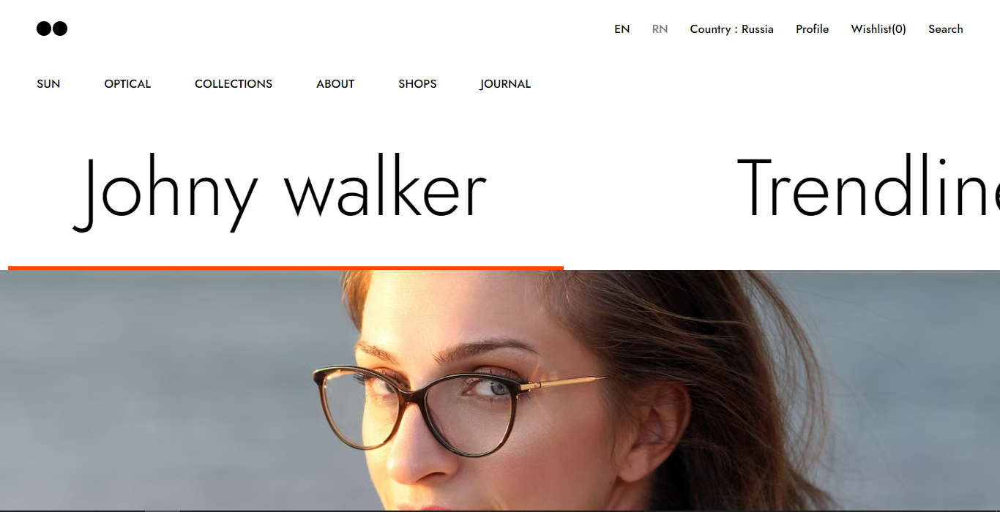

# Optical Shop Website

Welcome to the Optical Shop Website project! This is a static website built with HTML and CSS, designed for showcasing and exploring a variety of eyewear products.



## Table of Contents

- [Overview](#overview)
- [Demo](#demo)
- [Features](#features)
- [Installation](#installation)
- [Contributing](#contributing)
- [Acknowledgements](#acknowledgements)
- [License](#license)

## Overview

The Optical Shop Website provides a platform for users to browse and learn about different eyeglasses and sunglasses products. It aims to create a visually appealing and user-friendly experience for customers interested in optical products.

## Demo

Explore the live demo of the Optical Shop Website: [Live Demo](https://your-demo-url.com)

## Features

- **Product Showcase:** Explore a diverse collection of eyeglasses and sunglasses with detailed information.
- **Filtering and Sorting:** Easily filter products by categories, brands, and sort them based on preferences.
- **Shopping Cart:** Add products to a shopping cart and proceed to checkout.
- **Responsive Design:** Enjoy a seamless experience on different devices.

## Installation

To run the Optical Shop Website locally, follow these steps:

1. Clone the repository:

   ```bash
   git clone https://github.com/your-username/optical-shop-website.git
   cd optical-shop-website
   ```

2. Open the `index.html` file in your preferred web browser.

## Contributing

Contributions to enhance the Optical Shop Website are welcome! If you have suggestions, find a bug, or want to add new features, please follow the [contribution guidelines](CONTRIBUTING.md).

1. Fork the repository.
2. Create a new branch (`git checkout -b feature/your-feature`).
3. Make changes and commit them (`git commit -am 'Add some feature'`).
4. Push to the branch (`git push origin feature/your-feature`).
5. Create a new pull request.

## Acknowledgements

We would like to express our appreciation to Unsplash for providing high-quality, royalty-free images that have been used in this Jacket Shop Website.

## License

This project is licensed under the [MIT License](LICENSE).

Feel free to adapt and customize this template based on your project's specific details. Happy coding! 👓✨
